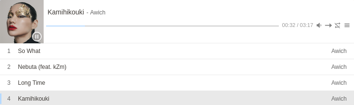

# SimplePlayer - پخش‌کننده پیشرفته موسیقی برای تایپ‌چو

<p align="center">
  
</p>

<p align="center">
  <a href="https://github.com/abdulhalim/SimplePlayer/releases"></a>
  <a href="https://typecho.org"></a>
  <a href="https://github.com/abdulhalim/SimplePlayer/blob/main/LICENSE"></a>
  <a href="https://github.com/abdulhalim/SimplePlayer/issues"></a>
  <a href="https://github.com/abdulhalim/SimplePlayer/stargazers"></a>
</p>

<p align="center">
  📢 یه پلاگین ساده ولی حرفه‌ای برای پخش موسیقی در تایپ‌چو - با پشتیبانی کامل از زبان فارسی و ظاهر مدرن
</p>

---

## 🎵 معرفی

**SimplePlayer** یک پلاگین قدرتمند و سبک برای سیستم مدیریت محتوای [Typecho](http://typecho.org) است که با استفاده از کتابخانه مدرن [APlayer](https://github.com/DIYgod/APlayer) امکان پخش آسان موسیقی را در نوشته‌ها فراهم می‌کند.

این پلاگین با تمرکز بر تجربه کاربری فارسی‌زبانان طراحی شده و تمامی المان‌های آن از راست‌چین بودن و فونت فارسی پشتیبانی می‌کنند.

<div dir="rtl">

## ✨ ویژگی‌ها

✅ **نصب و استفاده آسان** - فقط با یک شورت‌کد ساده  
✅ **پشتیبانی کامل از زبان فارسی** - نمایش عنوان و خواننده به صورت راست‌چین  
✅ **لیست پخش جدولی** - نمایش زیبای لیست آهنگ‌ها با ساختار جدولی  
✅ **تصویر پیش‌فرض SVG** - در صورت نداشتن کاور، یک نت موسیقی زیبا نمایش داده می‌شود  
✅ **قابلیت تنظیم رنگ تم** - هماهنگی با ظاهر سایت شما  
✅ **پخش خودکار** - امکان فعال‌سازی پخش خودکار  
✅ **حلقه و ترتیب پخش** - پخش تکراری یا تصادفی  
✅ **واکنش‌گرا** - نمایش مناسب در موبایل و تبلت  
✅ **پشتیبانی از چند پلیر همزمان** - امکان قرار دادن چند پلیر در یک صفحه  
✅ **پشتیبانی از فرمت‌های مختلف** - MP3 و سایر فرمت‌های پشتیبانی شده توسط HTML5  
✅ **حافظه پخش** - آخرین آهنگ پخش شده را ذخیره می‌کند

</div>

## 📥 نصب

### نصب دستی

1. فایل‌های پلاگین را از [صفحه انتشار](https://github.com/abdulhalim/SimplePlayer/releases) دانلود کنید
2. فایل‌ها را در مسیر `/usr/plugins/SimplePlayer` آپلود کنید
3. از پیشخوان مدیریت تایپ‌چو، به بخش **مدیریت پلاگین‌ها** بروید
4. پلاگین **SimplePlayer** را فعال کنید
5. به بخش **تنظیمات** پلاگین بروید و گزینه‌های مورد نظر را انتخاب کنید

## ⚙️ تنظیمات

پس از فعال‌سازی، می‌توانید از طریق **مدیریت پلاگین‌ها > SimplePlayer > تنظیمات** گزینه‌های زیر را شخصی‌سازی کنید:

| تنظیمات | توضیحات |
|--------|---------|
| **پخش خودکار** | فعال/غیرفعال کردن پخش خودکار موسیقی هنگام بارگذاری صفحه |
| **حلقه (تکرار)** | پخش تکراری لیست آهنگ‌ها |
| **ترتیب پخش** | پخش به ترتیب لیست یا به صورت تصادفی |
| **رنگ تم** | انتخاب رنگ اصلی پلیر (به صورت کد hex) |

## 📝 روش استفاده

برای قرار دادن پلیر در نوشته‌ها، از شورت‌کد زیر استفاده کنید:

```
[player]
آدرس فایل | عنوان | خواننده | (اختیاری) آدرس تصویر کاور
[player]
```

### ساختار هر خط

هر خط از فرمت زیر پیروی می‌کند (قسمت‌ها با `|` جدا می‌شوند):

```
[آدرس MP3] | [عنوان] | [نام خواننده] | [آدرس تصویر کاور - اختیاری]
```

### روش‌های مختلف تعریف آدرس

#### روش ۱: آدرس ساده
```
https://example.com/song.mp3 | شب بو | فریدون فروغی
```

#### روش ۲: استفاده از لینک (تگ <a>)
```
<a href="https://example.com/song.mp3">آهنگ زیبا</a> | شب بو | فریدون فروغی
```

#### روش ۳: همراه با کاور
```
https://example.com/song.mp3 | شب بو | فریدون فروغی | https://example.com/cover.jpg
```

#### روش ۴: لینک جداگانه برای کاور
```
<a href="https://example.com/song.mp3">آهنگ</a> | شب بو | فریدون فروغی | <a href="https://example.com/cover.jpg">کاور</a>
```

## 🌟 مثال‌ها

### مثال ۱: پلیر ساده با یک آهنگ

```markdown
[player]
https://example.com/song.mp3 | شب بو | فریدون فروغی
[player]
```

### مثال ۲: پلیر با چند آهنگ و کاور

```markdown
## آهنگ‌های مورد علاقه من

[player]
https://example.com/song1.mp3 | شب بو | فریدون فروغی | https://example.com/cover1.jpg
https://example.com/song2.mp3 | هوای گریه | علیرضا قربانی | https://example.com/cover2.jpg
https://example.com/song3.mp3 | سلطان قلب‌ها | ابی
https://example.com/song4.mp3 | همخونه | خشایار اعتمادی | https://example.com/cover3.jpg
[player]
```

### مثال ۳: استفاده در قالب‌های مختلف

```markdown
<div class="my-custom-player">
  
[player]
https://example.com/song1.mp3 | بهار دلنشین | حمیدرضا ترکاشوند
https://example.com/song2.mp3 | گنجشکک اشی مشی | کودکانه
[player]

</div>
```

## 🎨 شخصی‌سازی استایل

پلاگین با استایل‌های از پیش تعریف شده ارائه می‌شود، اما می‌توانید با افزودن CSS دلخواه به قالب خود، ظاهر پلیر را تغییر دهید. برخی از کلاس‌های مهم:

```css
/* کانتینر اصلی پلیر */
.aplayer {
  border-radius: 10px;
  box-shadow: 0 5px 15px rgba(0,0,0,0.1);
}

/* بخش تصویر کاور */
.aplayer-pic {
  border-radius: 8px 0 0 8px;
}

/* بخش اطلاعات آهنگ */
.aplayer-info {
  background: linear-gradient(to right, #f8f9fa, #ffffff);
}

/* لیست پخش */
.aplayer-list {
  max-height: 300px;
  overflow-y: auto;
}

/* هر سطر در لیست پخش */
.aplayer-list-item {
  padding: 8px 15px;
  border-bottom: 1px solid #eee;
}

.aplayer-list-item:hover {
  background-color: #f5f5f5;
}

/* تنظیم فونت فارسی */
.aplayer-title,
.aplayer-author,
.aplayer-list-title,
.aplayer-list-author {
  font-family: 'Vazir', 'Tahoma', sans-serif;
}
```

## 🔧 نیازمندی‌ها

- **Typecho** نسخه ۱.۰ یا بالاتر
- **PHP** نسخه ۷.۲ یا بالاتر
- **مرورگر مدرن** با پشتیبانی از HTML5 Audio (کروم، فایرفاکس، سافاری، اج)

## 🌐 تکنولوژی‌های استفاده شده

- [APlayer](https://github.com/DIYgod/APlayer) - کتابخانه پخش‌کننده تحت وب
- [Material Icons](https://fonts.google.com/icons) - آیکون‌های گوگل
- [jQuery](https://jquery.com) - برای تعاملات جاوااسکریپتی

## 📅 تغییرات

### نسخه 1.0 (آخرین نسخه)
- انتشار اولیه پلاگین
- پشتیبانی کامل از زبان فارسی
- قابلیت تنظیم رنگ تم
- پشتیبانی از چند پلیر همزمان
- تصویر پیش‌فرض SVG

## 📜 مجوز

این پروژه تحت مجوز **MIT** منتشر شده است. استفاده، ویرایش و توزیع آن آزاد است.

```
MIT License

Copyright (c) 2024 Abdul Halim

Permission is hereby granted, free of charge, to any person obtaining a copy
of this software and associated documentation files...
```

---

<p align="center">
  ساخته شده با ❤️ برای جامعه تایپ‌چو فارسی
  <br>
  <a href="https://github.com/abdulhalim/SimplePlayer">گیت‌هاب</a> •
  <a href="https://github.com/abdulhalim/SimplePlayer/releases">دانلود</a>
</p>
